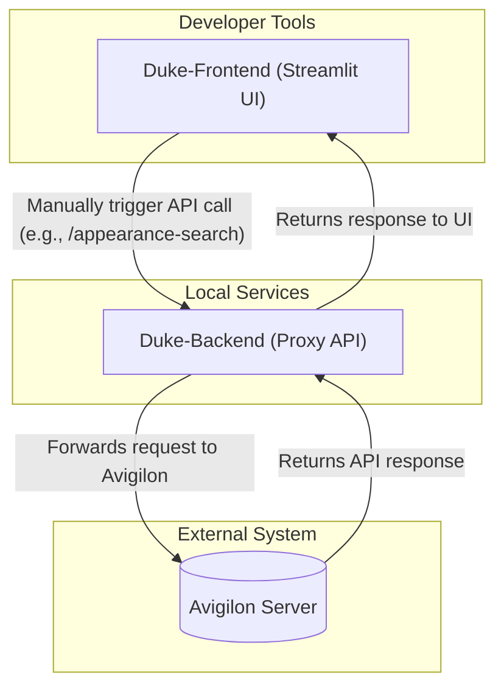

# Duke-Frontend: Developer Tool Technical Overview

## 1. Purpose and Scope

This document provides a technical overview of the `Duke-Frontend`, a development and debugging tool designed to support the integration with the Avigilon security system.

The primary purpose of this application is to provide an exploratory, interactive user interface for developers working on the `Duke-Backend` and `Duke-Central` services. It allows for manual interaction with the Avigilon API (via the `Duke-Backend` proxy) to understand its behavior, test new features, and generate sample data.

**Important**: This `Duke-Frontend` is strictly a **development tool**. It is not part of the production application stack and is distinct from the `Duke-Central Frontend` UI, which is used for data visualization.

## 2. Architecture and Data Flow

The `Duke-Frontend` operates as a client to the `Duke-Backend` service. A developer uses the frontend's UI to construct an API request, which is sent to the `Duke-Backend`. The backend then proxies this request to the live Avigilon server, returning the response to the UI for inspection.

This workflow allows developers to bypass the automated, scheduled nature of the production services for direct, on-demand API interaction.



## 3. Key Features

The interface is designed to streamline the development and debugging process with the following features:

*   **API Explorer**: A simple interface to select the target Avigilon API endpoint to query through the `Duke-Backend` proxy.
*   **Dynamic Parameter Input**: UI controls (text boxes, date pickers) to easily modify request parameters like timestamps, camera IDs, and event filters.
*   **Request & Response Viewer**: Displays the exact JSON payload sent to the Avigilon API and the raw JSON response received, which is critical for debugging data structures and values.
*   **Image Preview**: Automatically detects Base64-encoded image strings within API responses (common in `appearance-search` results), decodes them, and renders the image directly in the UI for quality verification.

## 4. Technology and Setup

*   **Technology**: Python, Streamlit.
*   **Prerequisites**: Requires a running instance of the `Duke-Backend` service that it can connect to over the network.
*   **Configuration**: The URL for the target `Duke-Backend` must be configured in the `.streamlit/secrets.toml` file.
    ```toml
    # .streamlit/secrets.toml
    DUKE_BACKEND_BASE = "http://localhost:8000"
    ```
*   **Execution**: The application is launched using the standard Streamlit command:
    ```bash
    streamlit run app.py
    ```

## 5. Development Use Cases

This tool is intended to accelerate development for both backend services.

### For `Duke-Backend` Development:
*   **Endpoint Testing**: Quickly test changes to proxy logic for existing or new Avigilon endpoints.
*   **Debugging**: Isolate issues related to authentication, request formatting, or connectivity with the Avigilon server.
*   **Data Discovery**: Explore the structure of different API responses before writing data extraction and processing logic in the backend.

### For `Duke-Central` Development:
*   **Data Simulation**: Generate live, realistic event data from Avigilon without waiting for the `Duke-Backend` schedulers.
*   **Ingestion Testing**: A developer can use the `Duke-Frontend` to fetch a sample event, copy the resulting JSON response, and use a tool like `curl` or Postman to `POST` it directly to the `Duke-Central` API endpoints, thereby testing the data ingestion and database storage logic.

